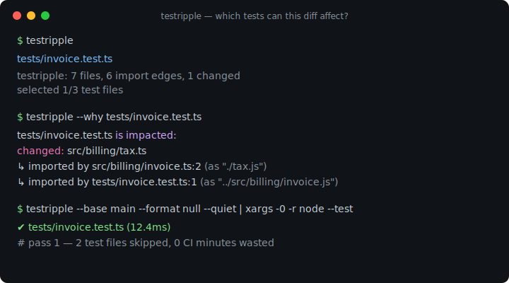
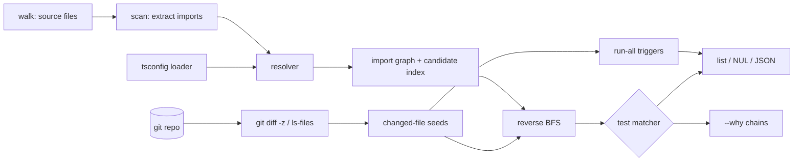

# testripple

[English](README.md) | [中文](README.zh.md) | [日本語](README.ja.md)

[](LICENSE)  [](CHANGELOG.md)  [](CONTRIBUTING.md)

**testripple：静的 import グラフ解析により、git diff が影響し得るテストを算出するオープンソースのゼロ依存 CLI ——コマンド一つ、monorepo ツールチェーンの導入は不要。**



```bash
git clone https://github.com/JaydenCJ/testripple && cd testripple
npm install && npm run build     # devDependency: typescript, nothing else
npm link                         # puts `testripple` on your PATH
```

> プレリリース：v0.1.0 はまだ npm に公開されていません。上記の手順でソースからビルドしてください（Node ≥22.13）。

## なぜ testripple？

どの TypeScript チームも遅かれ早かれ同じ請求項目に気づきます：1 行の変更で CI がテストスイート全体を回し、その費用はリポジトリと共に膨らみ続ける。既存の解決策はどれもプラットフォーム移行を要求します——Nx はリポジトリを workspace とタスクグラフに再構築させ、Bazel は BUILD ファイルの散在と新しいメンタルモデルを求め、Turborepo はパッケージ粒度でしか選択できず、200 ファイルのパッケージで 1 ファイル触れても全体が再実行される。一方 `jest --changedFilesWithAncestor` は単一 runner に縛られ、中身を検査できない haste-map ヒューリスティクスに依存します。testripple は地味で監査可能な道を取ります：ファイルが既に宣言している import を解析し、tsc と同じ方法で解決し（tsconfig `paths`、NodeNext の `.js`→`.ts` リマップ、index ファイルを含む）、グラフを反転させ、diff からテストまで辿る。リポジトリをそのまま読む単一コマンドであり、影響を受けるテストのパスを stdout に出力してあらゆる runner に渡せ、`--why` で各選択の根拠を具体的な `import` チェーン——ファイルと行番号付き——で提示できます。

| | testripple | Nx affected | Bazel + rules_ts | jest --changedFiles |
|---|---|---|---|---|
| 導入コスト | CLI 一つ、設定ゼロ | workspace 移行 | BUILD ファイルを全域に | Jest 限定フラグ |
| 選択の粒度 | ファイル単位の import グラフ | プロジェクト単位 | ターゲット単位 | ファイル単位（haste map） |
| runner 非依存の出力 | ✅ stdout パス / JSON / NUL | ❌ 自前の executor 経由 | ❌ Bazel 経由 | ❌ Jest のみ |
| 各選択を説明できる | ✅ `--why` import チェーン | 部分的（グラフ UI） | クエリ言語 | ❌ |
| 削除ファイルの扱い | ✅ 候補パス追跡 | ✅ | ✅ | ❌ 静かに脱落 |
| tsconfig `paths` エイリアス | ✅ | ✅ | 設定次第 | moduleNameMapper 経由 |
| ランタイム依存 | 0 | 数十個 | Bazel 自体 | Jest 自体 |

<sub>依存数の確認日 2026-07-13：testripple の `dependencies` は空（devDependency は `typescript` のみ）；`nx@21` は 40+ のランタイムパッケージを導入。</sub>

## 特徴

- **設定ゼロの影響分析** — 任意の git リポジトリに向けるだけ。ソースファイル・テスト・`tsconfig.json` を自力で発見します。workspace ファイルも、タスクグラフも、プラグインも不要。
- **正規表現の推測ではなく本物の解決** — lexer 級のスキャナ（コメント・文字列・テンプレート・正規表現リテラル対応）が tsc を模した resolver に接続：拡張子探索、`./x.js`→`./x.ts` NodeNext リマップ、`index.*`、`baseUrl`、最長プレフィックス優先の `paths`。
- **削除も波及する** — 解決失敗のたびに試行した候補パスを記録するため、モジュールを削除すると壊れた importer のテストが選ばれ、静かに素通りしません。
- **`--why` で領収書** — どの選択も、実在する `import` 文の最短チェーンとして説明でき、各ホップに file:line が付きます。
- **契約で合成可能** — 影響テストのパスは stdout へ（改行・NUL・`schema_version` 付き JSON）、人間向け要約は stderr へ；`node --test`、vitest、jest、`xargs` にそのままパイプできます。
- **安全弁を内蔵** — `package.json`・ロックファイル・`tsconfig*` の変更は「全部実行」を発火（`--run-all-on` で設定可能）；`--fail-on-unresolved` は宙に浮いた import をハード失敗に変えます。
- **オフラインかつ無音** — ネットワーク通信もテレメトリも一切なし；実行する外部プログラムはローカルの `git` だけで、`--files` モードなら git すら不要です。

## クイックスタート

```bash
bash examples/make-demo-repo.sh /tmp/ripple-demo   # tiny project + git history + one edit
cd /tmp/ripple-demo
testripple
```

実際にキャプチャした出力——3 件中 1 件のテストが選ばれ、要約は stderr に残ります：

```text
tests/invoice.test.ts
testripple: 7 files, 6 import edges, 1 changed
selected 1/3 test files
```

領収書を求める（`testripple --why tests/invoice.test.ts`、実際の出力）：

```text
tests/invoice.test.ts is impacted:
  changed: src/billing/tax.ts
  ↳ imported by src/billing/invoice.ts:2 (as "./tax.js")
  ↳ imported by tests/invoice.test.ts:1 (as "../src/billing/invoice.js")
```

その後、選択結果を任意の runner に渡します：

```bash
testripple --base main --format null --quiet | xargs -0 -r node --test
```

## CLI リファレンス

終了コード：0 正常 · 1 `--fail-on-unresolved` 該当または `--why` 不一致 · 2 使用法エラー · 3 実行時エラー。

| フラグ | 既定値 | 効果 |
|---|---|---|
| `--base <ref>` | — | `<ref>` と HEAD の merge base に対する diff、ローカル編集も加算 |
| `--staged` | オフ | ステージ済み変更のみ（`git diff --cached`） |
| `--files <paths>` | — | git を完全にスキップ；カンマ区切りの変更ファイル（繰り返し可） |
| `--root <dir>` | リポジトリ根 | 走査対象ディレクトリ、出力パスの基準点 |
| `--tsconfig <path>` | 自動検出 | `baseUrl`/`paths` エイリアスを供給する tsconfig |
| `--tests <glob>` | 組み込み 5 種 | テストファイルのパターン；既定を置換（繰り返し可） |
| `--run-all-on <glob>` | マニフェスト/設定 | 一致が変更されたら全テスト実行（繰り返し可） |
| `--ignore <dir>` | node_modules… | 追加でスキップするディレクトリ名（繰り返し可） |
| `--no-type-only` | オフ | 影響追跡時に `import type` エッジを無視 |
| `--format <f>` | `list` | `list`・`json`（schema_version 1）・`null`（NUL 区切り） |
| `--why <test>` | — | あるテストが選ばれた import チェーンを表示 |
| `--quiet`・`-q` | オフ | stderr の要約を抑制 |
| `--fail-on-unresolved` | オフ | import の解決失敗があれば終了コード 1 |

選択のセマンティクス——何が変更と見なされるか、指定子の解決方法、run-all トリガー、静的解析の誠実な限界——は [docs/selection-rules.md](docs/selection-rules.md) に明文化されています。

## 検証

このリポジトリは CI を同梱しません。上記のすべての主張はローカル実行で検証されます：

```bash
npm test                 # tsc build + 91 deterministic node:test cases, offline
bash scripts/smoke.sh    # end-to-end CLI check against a real git repo, prints SMOKE OK
```

## アーキテクチャ



## ロードマップ

- [x] v0.1.0 — import スキャナ、`paths`/NodeNext リマップ対応の tsc 風 resolver、逆到達可能性による選択、削除追跡、`--why` チェーン、run-all トリガー、list/JSON/NUL 出力、91 テスト + smoke スクリプト
- [ ] Watch モード：ファイル保存ごとに再選択し、ローカル TDD ループを高速化
- [ ] 巨大リポジトリ向け、ファイルハッシュをキーにしたグラフキャッシュ
- [ ] 選択したテストを直接実行する `--runner` プリセット
- [ ] Vue/Svelte 単一ファイルコンポーネントの import 抽出
- [ ] 選択信頼度レポート（run-all トリガーだけで実行されたテストの可視化）

完全な一覧は [open issues](https://github.com/JaydenCJ/testripple/issues) を参照してください。

## コントリビュート

Issue・ディスカッション・PR を歓迎します——ローカルのワークフロー（ビルド、テスト、`SMOKE OK`）は [CONTRIBUTING.md](CONTRIBUTING.md) を参照。入門向けタスクは [good first issue](https://github.com/JaydenCJ/testripple/issues?q=is%3Aissue+is%3Aopen+label%3A%22good+first+issue%22) のラベル付き、設計の議論は [Discussions](https://github.com/JaydenCJ/testripple/discussions) にあります。

## ライセンス

[MIT](LICENSE)
