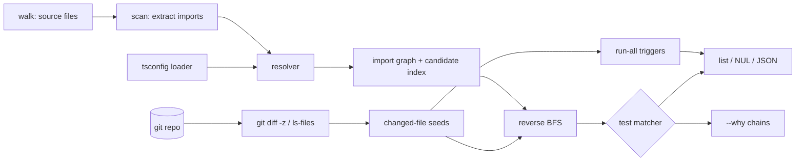

# testripple

[English](README.md) | [中文](README.zh.md) | [日本語](README.ja.md)

[](LICENSE)  [](CHANGELOG.md)  [](CONTRIBUTING.md)

**testripple：an open-source, zero-dependency CLI that computes which tests a git diff can affect via static import-graph analysis — one command, no monorepo toolchain to adopt.**


```bash
git clone https://github.com/JaydenCJ/testripple && cd testripple
npm install && npm run build     # devDependency: typescript, nothing else
npm link                         # puts `testripple` on your PATH
```

> Pre-release: v0.1.0 is not published to npm yet; build from source as above (Node ≥22.13).

## Why testripple?

Every TypeScript team eventually notices the same line item: CI runs the entire test suite for a one-line change, and the bill grows with the repo. The established fixes all demand a platform migration — Nx wants your repo restructured into its workspace and task graph, Bazel wants BUILD files and a new mental model, and Turborepo selects at package granularity, so touching one file in a package of two hundred still reruns everything in it. Meanwhile `jest --changedFilesWithAncestor` is locked to one runner and trusts haste-map heuristics you can't inspect. testripple takes the boring, auditable route: parse the imports your files already declare, resolve them the way tsc does (including tsconfig `paths`, NodeNext `.js`→`.ts` remaps, and index files), invert the graph, and walk from the diff to the tests. It is a single command that reads your repo as-is, prints impacted test paths on stdout for any runner to consume, and can justify every selection with a concrete `import` chain — file and line — via `--why`.

| | testripple | Nx affected | Bazel + rules_ts | jest --changedFiles |
|---|---|---|---|---|
| Adoption cost | one CLI, zero config | workspace migration | BUILD files everywhere | Jest-only flag |
| Selection granularity | file-level import graph | project-level | target-level | file-level (haste map) |
| Runner-agnostic output | ✅ stdout paths / JSON / NUL | ❌ runs via its executors | ❌ runs via Bazel | ❌ Jest only |
| Explains each selection | ✅ `--why` import chain | partial (graph UI) | query language | ❌ |
| Handles deleted files | ✅ candidate-path tracking | ✅ | ✅ | ❌ silently drops |
| tsconfig `paths` aliases | ✅ | ✅ | via config | via moduleNameMapper |
| Runtime dependencies | 0 | dozens | Bazel itself | Jest itself |

<sub>Dependency counts checked 2026-07-13: testripple's `dependencies` is empty (`typescript` is the sole devDependency); `nx@21` installs 40+ runtime packages.</sub>

## Features

- **Zero-config impact analysis** — point it at any git repo; it discovers source files, tests, and `tsconfig.json` on its own. No workspace file, no task graph, no plugin.
- **Real resolution, not regex guesses** — a lexer-grade scanner (comments, strings, templates, regex literals) feeds a resolver that mirrors tsc: extension probing, `./x.js`→`./x.ts` NodeNext remaps, `index.*`, `baseUrl`, and `paths` with longest-prefix-wins.
- **Deletions ripple too** — every failed resolution records the candidate paths it tried, so removing a module selects the tests of its now-broken importers instead of silently passing.
- **`--why` receipts** — any selection can be explained as the shortest chain of real `import` statements, with file:line for every hop.
- **Composable by contract** — impacted test paths on stdout (newline, NUL, or JSON with `schema_version`), human summary on stderr; pipe into `node --test`, vitest, jest, or `xargs`.
- **Safety valves built in** — changes to `package.json`, lockfiles, or `tsconfig*` trigger a run-everything response (configurable with `--run-all-on`); `--fail-on-unresolved` turns dangling imports into a hard failure.
- **Offline and silent** — no network calls, no telemetry, ever; the only external program it runs is your local `git`, and `--files` mode needs no git at all.

## Quickstart

```bash
bash examples/make-demo-repo.sh /tmp/ripple-demo   # tiny project + git history + one edit
cd /tmp/ripple-demo
testripple
```

Real captured output — one test selected out of three, and the summary stays on stderr:

```text
tests/invoice.test.ts
testripple: 7 files, 6 import edges, 1 changed
selected 1/3 test files
```

Ask for the receipt (`testripple --why tests/invoice.test.ts`, real output):

```text
tests/invoice.test.ts is impacted:
  changed: src/billing/tax.ts
  ↳ imported by src/billing/invoice.ts:2 (as "./tax.js")
  ↳ imported by tests/invoice.test.ts:1 (as "../src/billing/invoice.js")
```

Then hand the selection to any runner:

```bash
testripple --base main --format null --quiet | xargs -0 -r node --test
```

## CLI reference

Exit codes: 0 ok · 1 `--fail-on-unresolved` hit or `--why` miss · 2 usage error · 3 runtime error.

| Flag | Default | Effect |
|---|---|---|
| `--base <ref>` | — | diff against the merge base of `<ref>` and HEAD, plus local edits |
| `--staged` | off | staged changes only (`git diff --cached`) |
| `--files <paths>` | — | skip git entirely; comma-separated changed files (repeatable) |
| `--root <dir>` | repo root | directory to scan and anchor output paths to |
| `--tsconfig <path>` | auto-detect | tsconfig supplying `baseUrl`/`paths` aliases |
| `--tests <glob>` | 5 built-ins | test-file pattern; replaces the defaults (repeatable) |
| `--run-all-on <glob>` | manifests/configs | run everything when a match changes (repeatable) |
| `--ignore <dir>` | node_modules… | extra directory name to skip (repeatable) |
| `--no-type-only` | off | ignore `import type` edges when tracing impact |
| `--format <f>` | `list` | `list`, `json` (schema_version 1), or `null` (NUL-separated) |
| `--why <test>` | — | print the import chain that selects one test |
| `--quiet`, `-q` | off | suppress the stderr summary |
| `--fail-on-unresolved` | off | exit 1 if any import failed to resolve |

Selection semantics — what counts as changed, how specifiers resolve, run-all triggers, and the honest limits of static analysis — are specified in [docs/selection-rules.md](docs/selection-rules.md).

## Verification

This repository ships no CI; every claim above is verified by local runs:

```bash
npm test                 # tsc build + 91 deterministic node:test cases, offline
bash scripts/smoke.sh    # end-to-end CLI check against a real git repo, prints SMOKE OK
```

## Architecture



## Roadmap

- [x] v0.1.0 — import scanner, tsc-style resolver with `paths`/NodeNext remaps, reverse-reachability selection, deletion tracking, `--why` chains, run-all triggers, list/JSON/NUL output, 91 tests + smoke script
- [ ] Watch mode: re-select on file save for a tight local TDD loop
- [ ] Graph cache keyed by file hashes for very large repos
- [ ] `--runner` presets that exec the selected tests directly
- [ ] Vue/Svelte single-file-component import extraction
- [ ] Selection confidence report (which tests ran only due to run-all triggers)

See the [open issues](https://github.com/JaydenCJ/testripple/issues) for the full list.

## Contributing

Issues, discussions and pull requests are welcome — see [CONTRIBUTING.md](CONTRIBUTING.md) for the local workflow (build, tests, `SMOKE OK`). Good entry points are labelled [good first issue](https://github.com/JaydenCJ/testripple/issues?q=is%3Aissue+is%3Aopen+label%3A%22good+first+issue%22), and design questions live in [Discussions](https://github.com/JaydenCJ/testripple/discussions).

## License

[MIT](LICENSE)
