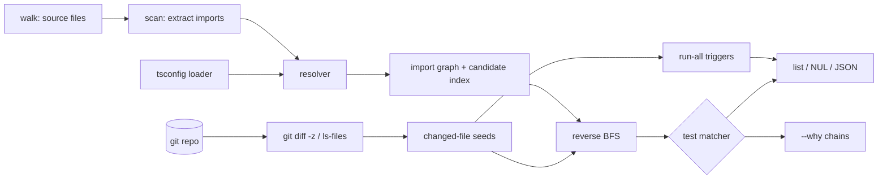

# testripple

[English](README.md) | [中文](README.zh.md) | [日本語](README.ja.md)

[](LICENSE)  [](CHANGELOG.md)  [](CONTRIBUTING.md)

**testripple：一个开源、零依赖的 CLI，通过静态 import 图分析计算一次 git diff 可能影响哪些测试——一条命令，无需引入任何 monorepo 工具链。**


```bash
git clone https://github.com/JaydenCJ/testripple && cd testripple
npm install && npm run build     # devDependency: typescript, nothing else
npm link                         # puts `testripple` on your PATH
```

> 预发布：v0.1.0 尚未发布到 npm；请按上述方式从源码构建（Node ≥22.13）。

## 为什么选 testripple？

每个 TypeScript 团队迟早都会注意到同一笔账：改一行代码，CI 却跑完整个测试套件，而且账单随仓库增长。现有的解法都要求平台级迁移——Nx 要求把仓库重构进它的 workspace 和任务图，Bazel 要求到处写 BUILD 文件并接受一套新的心智模型，Turborepo 只到包粒度做选择，在两百个文件的包里改一个文件仍会重跑整包。与此同时 `jest --changedFilesWithAncestor` 绑死一个 runner，且依赖你无法审视的 haste-map 启发式。testripple 走的是朴素、可审计的路线：解析文件里本来就声明的 import，按 tsc 的方式解析它们（包括 tsconfig `paths`、NodeNext 的 `.js`→`.ts` 重映射和 index 文件），把图反转，从 diff 一路走到测试。它是一条读取仓库原样的单一命令，把受影响的测试路径打印到 stdout 供任意 runner 消费，并能用 `--why` 给每次选择出示具体的 `import` 链——精确到文件和行号。

| | testripple | Nx affected | Bazel + rules_ts | jest --changedFiles |
|---|---|---|---|---|
| 采用成本 | 一个 CLI，零配置 | workspace 迁移 | 到处写 BUILD 文件 | 仅限 Jest 的旗标 |
| 选择粒度 | 文件级 import 图 | 项目级 | target 级 | 文件级（haste map） |
| 与 runner 无关的输出 | ✅ stdout 路径 / JSON / NUL | ❌ 经由其 executor 运行 | ❌ 经由 Bazel 运行 | ❌ 仅 Jest |
| 能解释每次选择 | ✅ `--why` import 链 | 部分（图形界面） | 查询语言 | ❌ |
| 处理已删除文件 | ✅ 候选路径追踪 | ✅ | ✅ | ❌ 静默丢弃 |
| tsconfig `paths` 别名 | ✅ | ✅ | 需配置 | 经 moduleNameMapper |
| 运行时依赖 | 0 | 数十个 | Bazel 本身 | Jest 本身 |

<sub>依赖数量核查于 2026-07-13：testripple 的 `dependencies` 为空（唯一 devDependency 是 `typescript`）；`nx@21` 安装 40+ 个运行时包。</sub>

## 特性

- **零配置影响分析** — 指向任意 git 仓库即可；它自行发现源码文件、测试和 `tsconfig.json`。没有 workspace 文件，没有任务图，没有插件。
- **真解析，不靠正则猜** — lexer 级扫描器（注释、字符串、模板、正则字面量）对接一个仿 tsc 的解析器：扩展名探测、`./x.js`→`./x.ts` NodeNext 重映射、`index.*`、`baseUrl`，以及最长前缀优先的 `paths`。
- **删除同样会涟漪** — 每次解析失败都会记录尝试过的候选路径，因此删掉一个模块会选中其已损坏的引用方的测试，而不是静默通过。
- **`--why` 出示凭据** — 任何选择都能被解释为一条最短的真实 `import` 语句链，每一跳都带 file:line。
- **按契约可组合** — 受影响的测试路径走 stdout（换行、NUL 或带 `schema_version` 的 JSON），人类摘要走 stderr；可直接管道进 `node --test`、vitest、jest 或 `xargs`。
- **内建安全阀** — `package.json`、锁文件或 `tsconfig*` 的变更触发"全部运行"响应（可用 `--run-all-on` 配置）；`--fail-on-unresolved` 把悬空 import 变为硬失败。
- **离线且安静** — 永不联网、永无遥测；它唯一运行的外部程序是本地 `git`，而 `--files` 模式连 git 都不需要。

## 快速上手

```bash
bash examples/make-demo-repo.sh /tmp/ripple-demo   # tiny project + git history + one edit
cd /tmp/ripple-demo
testripple
```

真实捕获的输出——三个测试中选出一个，摘要留在 stderr：

```text
tests/invoice.test.ts
testripple: 7 files, 6 import edges, 1 changed
selected 1/3 test files
```

索要凭据（`testripple --why tests/invoice.test.ts`，真实输出）：

```text
tests/invoice.test.ts is impacted:
  changed: src/billing/tax.ts
  ↳ imported by src/billing/invoice.ts:2 (as "./tax.js")
  ↳ imported by tests/invoice.test.ts:1 (as "../src/billing/invoice.js")
```

然后把选择结果交给任意 runner：

```bash
testripple --base main --format null --quiet | xargs -0 -r node --test
```

## CLI 参考

退出码：0 正常 · 1 命中 `--fail-on-unresolved` 或 `--why` 未命中 · 2 用法错误 · 3 运行时错误。

| 旗标 | 默认值 | 效果 |
|---|---|---|
| `--base <ref>` | — | 对 `<ref>` 与 HEAD 的 merge base 做 diff，并叠加本地修改 |
| `--staged` | 关 | 仅已暂存的变更（`git diff --cached`） |
| `--files <paths>` | — | 完全跳过 git；逗号分隔的变更文件（可重复） |
| `--root <dir>` | 仓库根 | 要扫描的目录，输出路径也以此为锚点 |
| `--tsconfig <path>` | 自动探测 | 提供 `baseUrl`/`paths` 别名的 tsconfig |
| `--tests <glob>` | 5 个内建 | 测试文件模式；替换默认值（可重复） |
| `--run-all-on <glob>` | 清单/配置文件 | 匹配项变更时运行全部测试（可重复） |
| `--ignore <dir>` | node_modules… | 额外跳过的目录名（可重复） |
| `--no-type-only` | 关 | 追踪影响时忽略 `import type` 边 |
| `--format <f>` | `list` | `list`、`json`（schema_version 1）或 `null`（NUL 分隔） |
| `--why <test>` | — | 打印选中某个测试的 import 链 |
| `--quiet`、`-q` | 关 | 抑制 stderr 摘要 |
| `--fail-on-unresolved` | 关 | 任何 import 解析失败即退出 1 |

选择语义——什么算作变更、说明符如何解析、run-all 触发器，以及静态分析的诚实边界——详见 [docs/selection-rules.md](docs/selection-rules.md)。

## 验证

本仓库不附带 CI；上述每一条主张都由本地运行验证：

```bash
npm test                 # tsc build + 91 deterministic node:test cases, offline
bash scripts/smoke.sh    # end-to-end CLI check against a real git repo, prints SMOKE OK
```

## 架构



## 路线图

- [x] v0.1.0 — import 扫描器、带 `paths`/NodeNext 重映射的 tsc 风格解析器、反向可达性选择、删除追踪、`--why` 链、run-all 触发器、list/JSON/NUL 输出、91 个测试 + smoke 脚本
- [ ] Watch 模式：保存文件即重新选择，打造紧凑的本地 TDD 循环
- [ ] 以文件哈希为键的图缓存，服务超大仓库
- [ ] `--runner` 预设，直接执行选中的测试
- [ ] Vue/Svelte 单文件组件的 import 提取
- [ ] 选择置信度报告（哪些测试仅因 run-all 触发器而运行）

完整列表见 [open issues](https://github.com/JaydenCJ/testripple/issues)。

## 贡献

欢迎 issue、讨论与 PR——本地工作流（构建、测试、`SMOKE OK`）见 [CONTRIBUTING.md](CONTRIBUTING.md)。入门任务标记为 [good first issue](https://github.com/JaydenCJ/testripple/issues?q=is%3Aissue+is%3Aopen+label%3A%22good+first+issue%22)，设计讨论在 [Discussions](https://github.com/JaydenCJ/testripple/discussions)。

## 许可证

[MIT](LICENSE)
